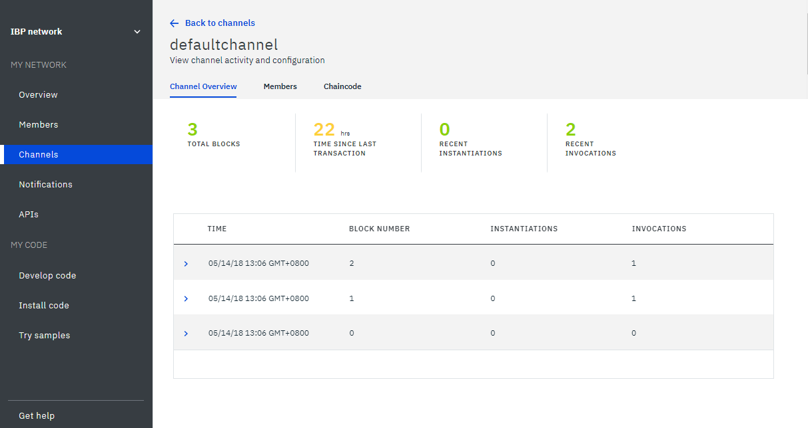
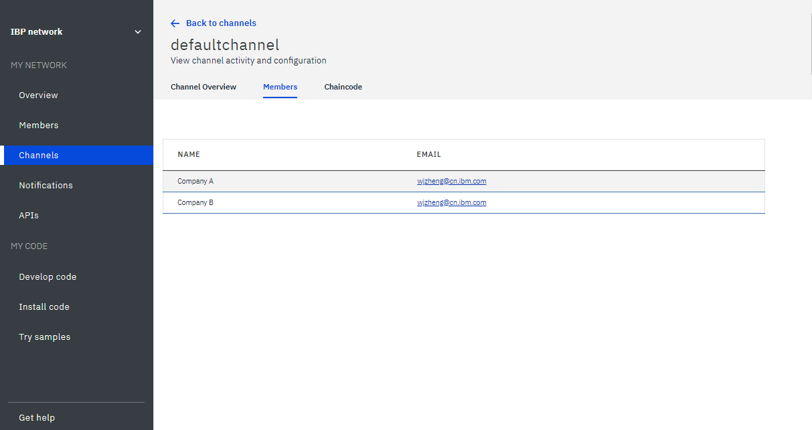

---

copyright:
  years: 2017, 2018
lastupdated: "2018-05-15"

---

{:new_window: target="_blank"}
{:shortdesc: .shortdesc}
{:screen: .screen}
{:codeblock: .codeblock}
{:pre: .pre}

# Monitoring a blockchain network

This tutorial shows how to view and monitor the status information of your {{site.data.keyword.blockchain}} network on {{site.data.keyword.Bluemix_short}}.
{:shortdesc}

## Monitoring channels

Enter Network Monitor and locate the channel that you want to view and monitor in the "Channel" screen.  In the specific channel screen, you can view the data status information, members, and instantiated chaincode of this channel in three tabs:

* **Channel Overview**  
  The "Channel Overview" tab shows the block information on this channel:
    * A series of data points, which include the total number of blocks that are created, the time interval since the last transaction, the number of chaincode instantiations, and the number of chaincode invocations.
    * A table that lists all blocks on this channel.  Expand a block and you can view the detailed information about the block.  

    

* **Members**  
  The "Members" tab shows the information of the members on this channel, including the email addresses for the organizational operators.
    

* **Chaincode**  
  The "Chaincode" tab lists all the chaincode that are instantiated on this channel with chaincode ID, version, and number of peers that are running the chaincode.   

  Expand a chaincode row to get detailed information about the chaincode:  
    * You can click **JSON** to view the JSON file of the chaincode.
    * You can click **Logs** to view logs of the chaincode.
    * You can click **Delete** to remove the running chaincode container.
    **Note**: Deleting the running chaincode container does not actually delete the chaincode. An instantiated chaincode on blockchain network cannot be deleted.

  

## Monitoring chaincode

Enter Network Monitor and open the "Install Code" screen. If you have running chaincode, choose a peer from the drop-down list and you can see all chaincode for this peer in the table with chaincode IDs and versions.  You can perform installation and instantiation for your chaincode on this screen.  For more information, see [Installing, instantiating, and updating a chaincode](install_instantiate_chaincode.html).

  

## Monitoring sample applications

In a Starter Plan network, you can view and access sample applications in the "Try Samples" screen of the Network Monitor.  After you deploy a sample application, you can click the **Launch** button to enter your application interface, or the **View on GitHub** link to visit the code repository.  For more information, see [Deploying sample applications](prebuilt_samples.html).

  
