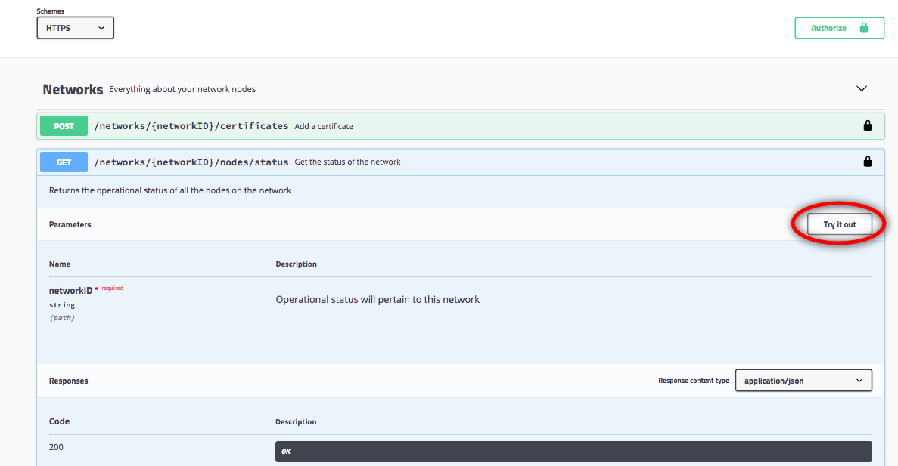

---

copyright:
  years: 2017, 2018
lastupdated: "2018-03-16"

---

{:new_window: target="_blank"}
{:shortdesc: .shortdesc}
{:screen: .screen}
{:codeblock: .codeblock}
{:pre: .pre}

# Prova delle API con Swagger

{{site.data.keyword.blockchainfull}} Platform presenta diverse API REST per facilitare il tuo sviluppo di applicazioni. Puoi eseguire un test sulle tue reti blockchain utilizzando una IU Swagger.
{:shortdesc}

Prima di iniziare, devi creare un'istanza del servizio [{{site.data.keyword.blockchain}} Platform ](https://console.bluemix.net/catalog/services/blockchain) su {{site.data.keyword.Bluemix_notm}} e creare, o aderire a, una rete blockchain Starter Plan <!--or Enterprise Plan -->.


## Richiamo delle credenziali di rete

Accedi al Network Monitor della tua rete Blockchain e apri la schermata "APIs" dal navigator a sinistra. Puoi visualizzare le tue credenziali di rete per le API REST. Autorizzerai successivamente le API utilizzando i valori di "key" e "secret" qui visualizzati ed eseguirai le API con il "network_id" come parametro. Fai clic su **Show secret** per visualizzare il valore del campo segreto. Copia i valori dei campi key, secret e network_id, che puoi utilizzare successivamente nell'IU Swagger.

<!-- Removing this code snippet so people don't try to use these values
```
},
   "x-api": {
       "url": "https://ibmblockchain.bluemix.net",
       "key": "PeerOrg1",
       "network_id": "e1f5b3341b1d483bbaf829f601144023",
       "secret": "71a329aabde9ff20de0aa4bfafd72a4466d78c87f637e7ff92c2534b5ce81cc0"
   }
```
-->

La **Figura 1** mostra la schermata "APIs":

*Figura 1. API*

Se stai utilizzando Starter Plan, è possibile passare da un'organizzazione all'altra nel Network Monitor. Con Starter Plan, le due organizzazioni sono configurate per impostazione predefinita. Passare da un'organizzazione all'altra può essere utile per provare le API REST dalla prospettiva di ciascuna organizzazione. Per ottenere le credenziali per un'altra organizzazione nella tua rete, fai clic sul tuo nome utente nell'angolo superiore destro della console Network Monitor. Nel menu che si apre, fai clic sulla freccia a discesa accanto all'organizzazione per visualizzare tutte le organizzazioni. Seleziona l'organizzazione a cui desideri passare e visualizza le credenziali di rete associate.

La **Figura 2** mostra come passare da un'organizzazione all'altra:

*Figura 2. Passare da un'organizzazione all'altra*


## Autorizzazione delle API Swagger

Fai clic sul link **Swagger UI** nella schermata "APIs" per aprire l'IU Swagger.  
<!-- remove this line because the link is different depending on if you are starter or enterprise plan
You can also open the Swagger UI with the URL in the connection profiles. For example, `http://blockchain-swagger-dev.stage1.mybluemix.net`.
-->

Nell'IU Swagger, fai clic sul pulsante **Authorize**; viene visualizzata la finestra di autorizzazione. Immetti il valore di chiave (key) e segreto (secret) nelle tue credenziali di rete come nome utente e password e fai clic su **Authorize** e quindi su **Done**. Ore sei pronto ad eseguire le API. Nota: se aggiorni il tuo browser, devi eseguire nuovamente l'autorizzazione con le tue credenziali.

Utilizzando l'autenticazione di tipo Autenticazione di base, qualsiasi credenziale da te specificata nella finestra Authorize viene memorizzata dopo che fai clic sui pulsanti **Authorize** e quindi **Done** e viene passata in ciascuna chiamata API REST.

La **Figura 3** mostra la finestra a comparsa "Authorize":

*Figura 3. Finestra a comparsa Authorize*


## Prova delle API

Fai clic sull'API REST che vuoi eseguire e fai clic sul pulsante **Try it out**. Immetti i parametri richiesti e fai clic su **Execute**. La chiamata API REST viene eseguita sulla rete.

La **Figura 4** mostra l'IU Swagger:

*Figura 4. IU Swagger*


## Suggerimenti per la soluzione dei problemi

### 401 Non autorizzato  
  Assicurati di disporre delle autorizzazioni necessarie per la API REST fornendo le tue credenziali di rete. Per ulteriori informazioni, vedi [Autorizzazione delle API Swagger](#authorizing-swagger-apis).

### Errore 400: Richiesta non valida
  Alcune API potrebbero prendere un argomento nel corpo della richiesta che funge da filtro per visualizzare i risultati solo per uno specifico peer. Nel corpo viene fornito un frammento di esempio che, se utilizzato, deve essere modificato per specificare il peer o l'elenco di peer su cui desiderare applicare il filtro. Per evitare questo errore, modificare il frammento per specificare un peer nella tua rete oppure rimuovere del tutto il frammento. 
