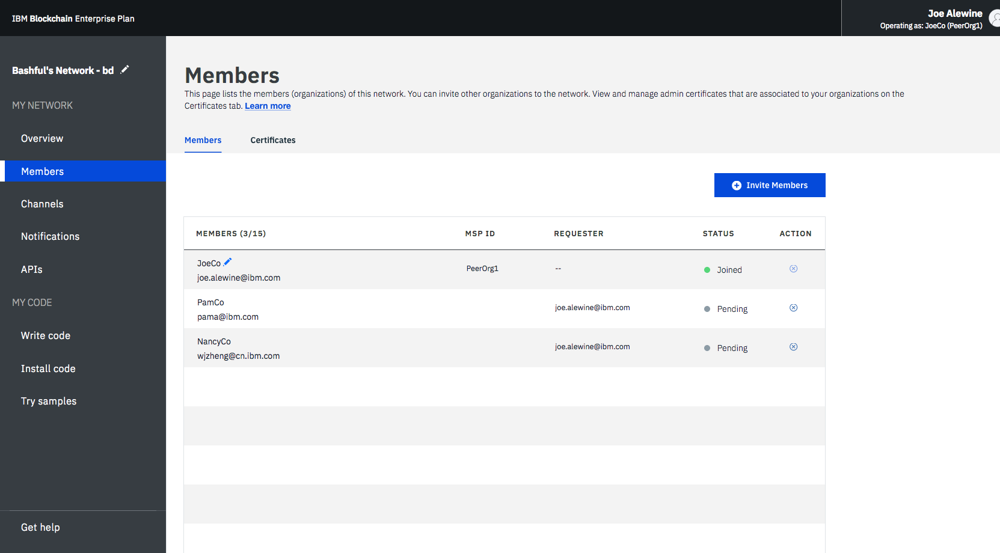
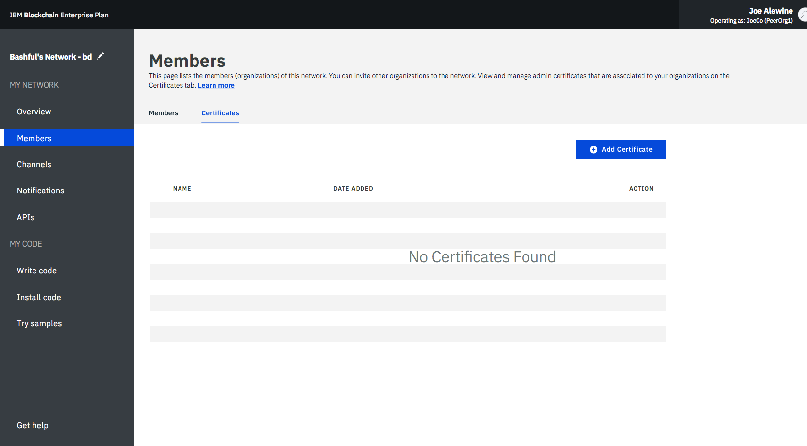
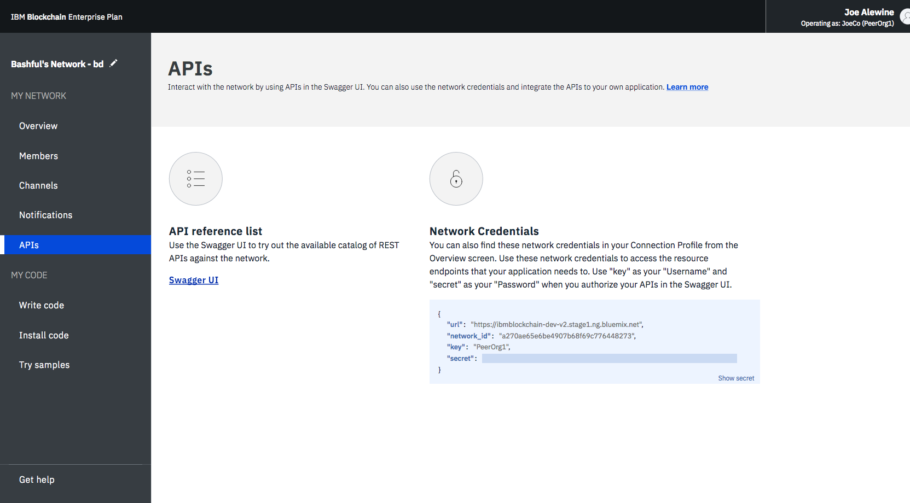

---

copyright:
  years: 2017, 2018
lastupdated: "2018-03-16"

---

{:new_window: target="_blank"}
{:shortdesc: .shortdesc}
{:codeblock: .codeblock}
{:screen: .screen}
{:pre: .pre}

# Gestione della rete Enterprise Plan
{: #v10_dashboard}

{{site.data.keyword.blockchainfull}} Platform offre un Network Monitor per fornire una panoramica del tuo ambiente blockchain, compresi risorse di rete, membri, canali oggetto di adesione, dati delle prestazioni delle transazioni e chaincode distribuiti. Il Network Monitor ti offre anche l'entry point per eseguire le API Swagger, sviluppare una rete con {{site.data.keyword.blockchainfull_notm}} Platform: Develop e provare le applicazioni di esempio.
{:shortdesc}

Il Network Monitor presenta le seguenti schermate in tre sezioni. Puoi passare a ciascuna schermata dal navigator a sinistra nel Network Monitor.
- La sezione **My network** contiene le schermate "[Overview](#overview)", "[Members](#members)", "[Channels](#channels)", "[Notifications](#notifications)" e "[APIs](#apis)".
- La sezione **My code** contiene le schermate "[Write code](#write_code)", "[Install code](#chaincode)" e "[Try samples](#samples)".
- La schermata "[Get help](#support)" mostra le informazioni di supporto e le note sulla release per Helios e Hyperledger Fabric (la base di codice su cui è basato {{site.data.keyword.blockchainfull_notm}} Platform).

## Overview
{: #overview}

Lo schermo "Overview" visualizza le informazioni sullo stato in tempo reale relative alle risorse blockchain, compresi l'ordinante, la CA e i nodi peer. Ogni risorsa viene visualizzata in quattro intestazioni distinte: **Type**, **Name**, **Status** e **Actions**. Durante la creazione della tua rete blockchain, vengono automaticamente creati tre nodi ordinante e due nodi CA. Le CA sono specifiche per i membri, mentre i nodi di ordine sono endpoint comuni condivisi nella rete.

La **Figura 1** mostra la schermata "Overview":

*Figura 1. Panoramica della rete*

### Azioni dei nodi
  L'intestazione **Actions** della tabella fornisce i pulsanti per avviare o arrestare le tue risorse. Puoi anche avviare o arrestare un gruppo di nodi selezionando più nodi e facendo quindi clic sul pulsante **Start Selected** o **Stop Selected**. Il pulsante **Start Selected** o quello **Stop Selected** sono visualizzati sopra la tabella quando selezioni uno o più nodi.

  Nota che le azioni Stop e Start non sono disponibili per un nodo Orderer. In generale, non è necessario arrestare e avviare i nodi Peer o CA su una rete. Le azioni Stop e Start sono fornite nel caso in cui tu abbia bisogno di riavviare un peer, ad esempio per attivarlo in uno stato pulito.

  Puoi anche controllare i log componenti facendo clic su **View Logs** dall'elenco a discesa sotto l'intestazione **Actions**. I log presentano le chiamate tra le diverse risorse di rete e sono utili per il debug e la risoluzione dei problemi. Fai una prova, ad esempio, arrestando un peer e provando a sceglierlo come obiettivo di una transazione; vedrai degli errori di connettività. Quando riavvii il peer e tenti nuovamente la transazione, vedrai una connessione stabilita correttamente. Puoi anche
lasciare inattivo il peer per un periodo di tempo prolungato mentre i tuoi canali continuano a interagire con il libro mastro. Quando il peer viene riattivato, noterai una sincronizzazione del libro mastro poiché riceve i blocchi di cui era stato eseguito il commit mentre era inattivo. Dopo che il libro mastro sarà stato completamente sincronizzato, puoi eseguire su di esso richiami e query normali.

### Connection Profile
  Puoi visualizzare il file JSON relativo alle informazioni di rete di basso livello di ciascuna risorsa facendo clic sul pulsante **Connection Profile**. Il profilo di connessione contiene tutte le informazioni di configurazione di cui hai bisogno per un'applicazione. Tuttavia, poiché questo file contiene solo gli indirizzi per i tuoi specifici componenti e l'ordinante, se hai bisogno di avere come obiettivo ulteriori peer devi ottenere i loro endpoint. L'intestazione che contiene "url" visualizza l'endpoint API di ciascun componente. Questi endpoint sono necessari per
avere come obiettivo specifici componenti di rete da un'applicazione lato client e le loro definizioni si trovano solitamente
in un file di configurazione di tipo JSON che accompagna l'applicazione. Se stai personalizzando un'applicazione che richiede l'approvazione da peer che non fanno parte della tua organizzazione, dovrai recuperare gli indirizzi IP di questi peer dagli operatori pertinenti in un'operazione fuori banda. I client devono riuscire a connettersi a
un qualsiasi peer da cui necessitano di una risposta.

### Add peers
{: #peers}
  Fai clic sul pulsante **Add Peers** per aggiungere dei nodi peer alla tua rete. In Starter Plan, due peer verranno aggiunti automaticamente per te quando viene creata la rete. In Enterprise Plan, puoi aggiungere nodi peer per la prima volta quando crei una rete o aderisci a essa oppure in un secondo momento nel Network Monitor. Ti potresti trovare in scenari differenti in cui hai bisogno di più peer. Ad esempio, potresti volere più peer che si uniscono allo stesso canale per la ridondanza. Ogni peer elabora le transazioni del canale e scrive nelle loro rispettive copie del libro mastro. In caso di malfunzionamento di uno dei peer, gli altri peer possono continuare ad elaborare transazioni e richieste di applicazione. Potresti bilanciare simmetricamente il carico di tutte le richieste di applicazione tra i peer o potresti indicare come obiettivo peer differenti per funzioni differenti. Puoi ad esempio usare un peer per eseguire query del libro mastro e utilizzare un altro peer per elaborare le approvazioni per gli aggiornamenti del libro mastro.

  Nel pannello "Add Peers" a comparsa, seleziona il numero di nodi peer che vuoi aggiungere.<!--Currently only "small" peers are available for purchase, however there will eventually be "medium" and "large" to help accommodate larger workloads and higher transaction throughput.-->

## Members
{: #members}
La schermata "Members" contiene due schede per visualizzare le informazioni sui membri della rete nella scheda "Members" e le informazioni sui certificati nella scheda "Certificates".

### Members
{: #members_tab}
La **Figura 2** mostra la schermata "Members" iniziale che visualizza i membri della tua rete nella schede "Members":

*Figura 2. Membri della rete*

Oltre ai membri che inviti quando crei la rete, puoi invitare altri membri nella scheda "Members". Per invitare un membro alla tua rete, immettere il nome dell'istituzione e l'indirizzo email dell'operatore e fai clic su **Add Member**. Una rete può avere un totale di 15 membri (compreso l'iniziatore della rete). Per rimuovere un membro dalla tua rete, fai clic sul simbolo di "rimozione" alla fine della riga del membro.

### Certificates
La **Figura 3** mostra la schermata "Members" iniziale che visualizza i certificati dei membri nella scheda "Certificates":

*Figura 3. Certificates*

Gli operatori possono gestire i certificati per i membri nella stessa istituzione nella scheda "Certificates". Fai clic su **Add Certificate** per aprire il pannello "Add Certificate". Dai un nome al tuo certificato, incolla i certificati lato client in formato PEM nel campo "Key" e fai clic su **Submit**. Devi riavviare i peer prima che i certificati lato client possano diventare effettivi.

Per ulteriori informazioni sulla generazione della tua chiave di certificato, vedi [Generazione dei certificati lato client](v10_application.html#generating-the-client-side-certificates).

## Channels
{: #channels}

Puoi suddividere la tua rete in canali, dove ogni canale rappresenta un sottoinsieme di membri autorizzati a visualizzare i dati per i chaincode istanziati su tale canale. Ogni rete deve avere almeno un canale perché le transazioni possano avere luogo. Ogni canale ha un libro mastro univoco e gli utenti devono essere correttamente autenticati per effettuare operazioni di lettura/scrittura su questo libro mastro. Se non ti trovi su un canale, non puoi vedere alcun dato.

La **Figura 4** mostra la schermata dashboard iniziale che visualizza una panoramica di tutti i canali nella tua rete:

*Figura 4. Canali*

La creazione di un canale comporta la generazione di un libro mastro specifico per il canale. Per ulteriori informazioni, vedi [Creazione di un canale](howto/create_channel.html).

Puoi anche selezionare un canale esistente per visualizzare dei dettagli più precisi sul canale, l'adesione e i chaincode attivi. Per ulteriori informazioni, vedi [Monitoraggio di una rete](howto/monitor_network.html).

## Notifications
{: #notifications}

Puoi gestire le richieste in sospeso e visualizzare le richieste completate nella schermata "Notifications".

La **Figura 5** mostra la schermata "Notifications":

*Figura 5. Notifiche*

Quando crei un canale o viene invitato a un nuovo canale, nel Network Monitor comparirà una notifica.

Le richieste sono raggruppate nelle sottoschede "All", "Pending" e "Completed". I numeri dopo l'intestazione della sottoscheda indicano il numero di richieste in ciascuna sottoscheda.
   * Puoi trovare tutte le tue richieste nella sottoscheda "All".
   * Le richieste che non hai accettato o rifiutato, o che non hai visualizzato, sono nella sottoscheda "Pending". Fai clic sul pulsante **Review Request** per visualizzare la richiesta, che include la politica e i membri del canale e lo stato di voto. Se sei un operatore del canale, puoi accettare **Accept** o declinare **Decline** la richiesta o gestirla in un altro momento facendo clic su **Later**. Se la richiesta viene accettata da un numero sufficiente di operatori del canale, puoi fare clic su **Submit Request** per attivare l'aggiornamento del canale.
   * Una richiesta inoltrata sarà visualizzata nella sottoscheda "Completed".  Puoi fare clic su **Review Request** per visualizzarne i dettagli.

Quando hai un lungo elenco di richieste, puoi cercare una richiesta nel campo di ricerca in alto.

Le richieste in sospeso possono essere eliminate selezionando le caselle davanti a esse e facendo clic su **Delete Request**. Nota: una richiesta completata non può essere eliminata.

## APIs
{: #apis}

Per facilitare lo sviluppo delle applicazioni, {{site.data.keyword.blockchainfull_notm}} Platform presenta delle API che puoi testare sulla tua rete in una IU Swagger.

*Figura 6. APIs*

Fai clic sul link **Swagger UI** per aprire l'IU Swagger. Nota: prima di eseguire le API, devi autorizzare l'IU Swagger con le tue credenziali di rete (che sono disponibili in questa pagina delle API). Per ulteriori informazioni, vedi [Utilizzo delle API Swagger](howto/swagger_apis.html).

## Write Code
{: #write-code}

Enterprise Plan integra {{site.data.keyword.blockchainfull_notm}} Platform: Develop e fornisce un ambiente di sviluppo con strumenti e tecnologie standard del settore. Puoi sviluppare la tua rete in un ambiente online oppure in locale. Dopo che hai sviluppato una rete, puoi distribuirla nuovamente alla tua rete Enterprise Plan.

*Figura 7. Write code*

Per ulteriori informazioni sullo sviluppo e sulla distribuzione del tuo codice con Enterprise Plan, vedi [Sviluppo di reti di business in Enterprise Plan](develop_enterprise.html).

## Install code
{: #chaincode}

I chaincode, noti anche come "smart contract", sono parti di software che contengono una serie di funzioni per eseguire query e aggiornamenti del libro mastro. Vengono installati sui peer e istanziati su un canale.

*Figura 8. Install code*

Un chaincode viene prima installato sul file system di un peer e viene quindi istanziato su un canale. Per ulteriori informazioni, vedi [Installazione e istanziazione di un chaincode](howto/install_instantiate_chaincode.html).

## Try samples
{: #samples}

Le applicazioni di esempio ti aiutano ad ottenere una migliore comprensione della rete blockchain e dello sviluppo di applicazioni. Segui il link al repository Marbles nel Network Monitor per informazioni su come installare l'applicazione di esempio Marbles. Per ulteriori informazioni su come sviluppare e distribuire i tuoi esempi, consulta [Sviluppo di applicazioni](v10_application.html).

La **Figura 9** mostra la schermata "Samples":

*Figura 9. Esempi*

## Get help
{: #support}

La schermata "Get help" contiene due schede per fornire le informazioni di supporto nella scheda "Support" e per descrivere le funzioni nuove e modificate di ciascuna release nella scheda "Release Notes".

La **Figura 10** mostra la schermata "Support" iniziale che visualizza le informazioni di supporto nella scheda "Support":

*Figura 10. Supporto blockchain*

Utilizza i link e le risorse in questa pagina per accedere ai forum di supporto e risoluzione dei problemi.

* [{{site.data.keyword.blockchainfull_notm}} Service docs](index.html) in **Getting started**, che è il sito della documentazione, fornisce istruzioni introduttive a {{site.data.keyword.blockchainfull}} Platform su {{site.data.keyword.Bluemix_notm}}. Puoi trovare gli argomenti corrispondenti dal navigator a sinistra oppure cercare qualsiasi termine con la funzione di ricerca in alto.
* [IBM Developer Works ](https://developer.ibm.com/blockchain/) in **COMMUNITY HELP** contiene le risorse e le informazioni per gli sviluppatori.
* [IBM dWAnswers ](https://developer.ibm.com/answers/smartspace/blockchain/) in **SUPPORT TICKET** funge da piattaforma per domande e risposte. Puoi cercare risposte dalle domande fatte in precedenza o inoltrare una nuova domanda. Assicurati di includere **blockchain** nella domanda.
  Puoi anche inoltrare un ticket al team di supporto {{site.data.keyword.blockchainfull_notm}} con l'opzione **Open an {{site.data.keyword.Bluemix_notm}} support ticket**.  Condividi dettagli e frammenti di codice dalla tua istanza specifica {{site.data.keyword.Bluemix_notm}}.
* [Le applicazioni di esempio ](https://github.com/ibm-blockchain) in **Blockchain sample applications** forniscono assistenza e frammenti di codice di esempio per agevolare lo sviluppo di applicazioni.
* [Hyperledger Fabric ](http://hyperledger-fabric.readthedocs.io/) e la [community Hyperledger Fabric ](http://jira.hyperledger.org/secure/Dashboard.jspa) in **Hyperledger Fabric** forniscono ulteriori dettagli sullo stack Hyperledger Fabric.
  Parla a un [esperto di Hyperledger ](https://chat.hyperledger.org/channel/general) se hai delle domande sul codice Hyperledger Fabric.

Se non riesci ad eseguire il debug del tuo problema o a individuare una risposta alla tua domanda, inoltra un caso di supporto al portale servizio di IBM Cloud. Per ulteriori informazioni, vedi [Richiesta di assistenza tecnica](ibmblockchain_support.html).

Le figure 11 e 12 mostrano la schermata "Get Help" iniziale che visualizza le funzioni nuove e modificate di ciascuna release nella scheda "Release Notes":

  
*Figura 11. Note sulla release per Helios*

  
*Figura 12. Note sulla release per Fabric*
