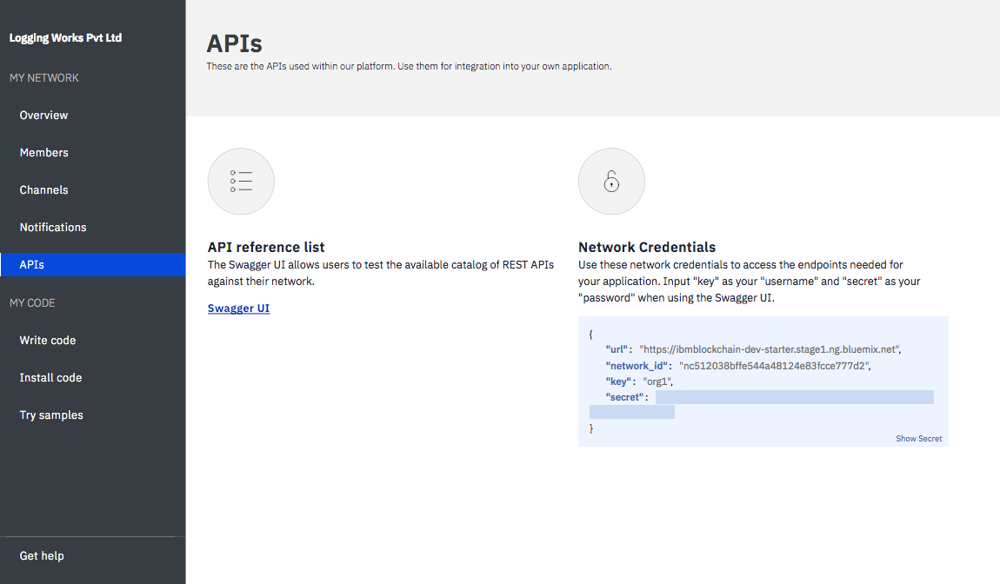
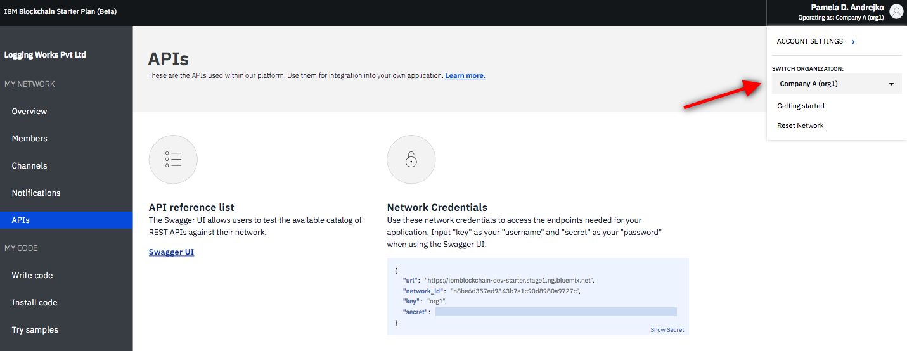

---

copyright:
  years: 2017, 2018
lastupdated: "2018-03-16"

---

{:new_window: target="_blank"}
{:shortdesc: .shortdesc}
{:screen: .screen}
{:codeblock: .codeblock}
{:pre: .pre}

# Swagger を使用した API の試行

{{site.data.keyword.blockchainfull}} Platform では、アプリケーション開発を円滑に進めることができるように、さまざまな REST API が公開されています。Swagger UI を使用して、ブロックチェーン・ネットワークに対してテストを行えます。
{:shortdesc}

始める前に、{{site.data.keyword.Bluemix_notm}} 上に [{{site.data.keyword.blockchain}} Platform サービス・インスタンス ](https://console.bluemix.net/catalog/services/blockchain) を作成し、Starter Plan <!--or Enterprise Plan -->ブロックチェーン・ネットワークを作成するか結合しておく必要があります。


## ネットワーク資格情報の取得

ブロックチェーン・ネットワークのネットワーク・モニターに入り、左側のナビゲーターから「API」画面を開きます。REST API のネットワーク資格情報が表示されます。後で、ここに表示された「key」と「secret」の値を使用して API を許可し、「network_id」をパラメーターとして使用して API を実行します。**「secret の表示 (Show secret)」**をクリックして secret フィールドの値を表示します。key、secret、および network_id フィールドの値をコピーします。これらの値は、後で Swagger UI で使用できます。

<!-- Removing this code snippet so people don't try to use these values
```
},
   "x-api": {
       "url": "https://ibmblockchain.bluemix.net",
       "key": "PeerOrg1",
       "network_id": "e1f5b3341b1d483bbaf829f601144023",
       "secret": "71a329aabde9ff20de0aa4bfafd72a4466d78c87f637e7ff92c2534b5ce81cc0"
   }
```
-->

次の**図 1** は、「API」画面を示しています。

*図 1. API*

Starter Plan を使用している場合は、ネットワーク・モニターで組織を切り替えることができます。Starter Plan では、デフォルトで 2 つの組織が構成されています。組織の切り替えは、各組織の観点から REST API を試す場合に役立ちます。 ネットワーク内の別の組織の資格情報を取得するには、ネットワーク・モニター・コンソールの右上隅に表示されるユーザー名をクリックします。開いたメニューで、組織の横にあるドロップダウン矢印をクリックして、すべての組織を表示します。切り替え先の組織を選択して、関連するネットワーク資格情報を表示します。

次の**図 2** は、組織を切り替える方法を示しています。

*図 2. 組織の切り替え*


## Swagger API の許可

「API」画面の**「Swagger UI」**リンクをクリックして Swagger UI を開きます。  
<!-- remove this line because the link is different depending on if you are starter or enterprise plan
You can also open the Swagger UI with the URL in the connection profiles. For example, `http://blockchain-swagger-dev.stage1.mybluemix.net`.
-->

Swagger UI で、**「許可 (Authorize)」**ボタンをクリックします。許可ウィンドウがポップアップ表示されます。ネットワーク資格情報の「key」と「secret」の値をユーザー名とパスワードとして入力し、**「許可 (Authorize)」**をクリックしてから**「完了」**をクリックします。これで、API を実行する準備ができました。ブラウザーを最新表示すると、資格情報を使用して再許可する必要があることに注意してください。

認証として「基本認証」を使用した場合、「許可 (Authorize)」ウィンドウで指定した資格情報は、**「許可 (Authorize)」**ボタンをクリックしてから**「完了」**ボタンをすると保管され、各 REST API 呼び出しで渡されます。

次の**図 3** は、「許可 (Authorize)」ポップアップ・ウィンドウを示しています。

*図 3.「許可 (Authorize)」ポップアップ・ウィンドウ*


## API の試行

実行する REST API をクリックして、**「試行する」**ボタンをクリックします。必須パラメーターを入力して、**「実行」**をクリックします。ネットワークに対して REST API 呼び出しが実行されます。

次の**図 4** は「Swagger UI」を示しています。

*図 4. Swagger UI*


## トラブルシューティングのヒント

### 401 認証が必要  
  ネットワーク資格情報を指定して REST API を許可したことを確認してください。詳しくは、[Swagger API の許可](#authorizing-swagger-apis)を参照してください。

### 400 エラー: 間違った要求
  API によっては、要求の本体で引数が使用される場合があります。この引数は、特定のピアに関する結果のみを表示するためのフィルターの機能を果たします。本体の中にサンプル・スニペットが記述されています。このサンプル・スニペットが使用されている場合は、編集して、フィルターに掛けるピアまたはピアのリストを指定する必要があります。このエラーを回避するには、スニペットを編集してネットワーク内のピアを指定するか、スニペット全体を削除します。
