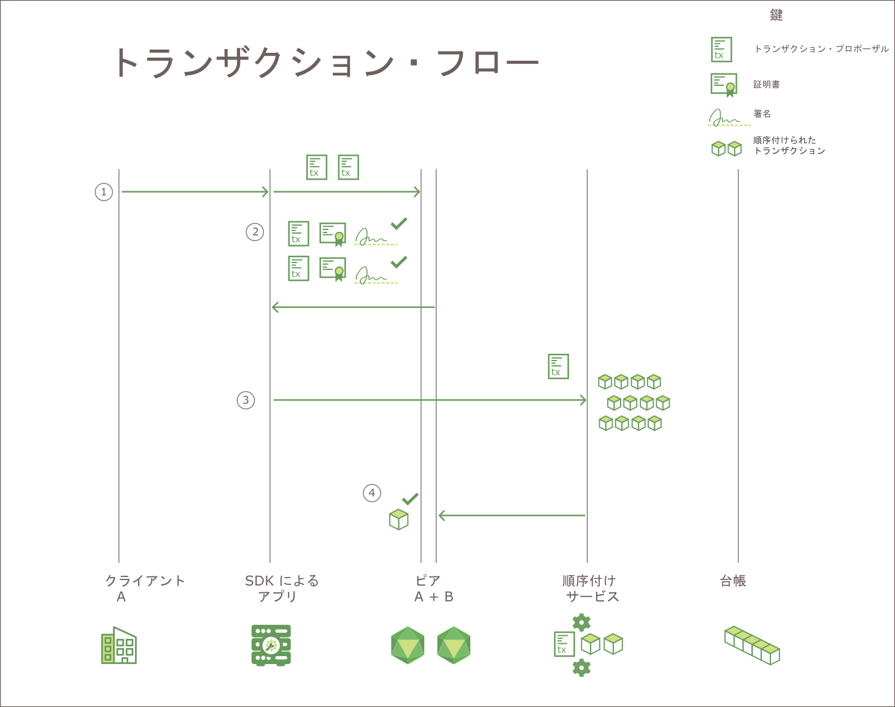

---

copyright:
  years: 2017, 2018
lastupdated: "2018-03-16"
---

{:new_window: target="_blank"}
{:shortdesc: .shortdesc}
{:codeblock: .codeblock}
{:screen: .screen}
{:pre: .pre}

# Hyperledger Fabric
{{site.data.keyword.blockchainfull}} ネットワークは、Linux Foundation の Hyperledger Project 内のブロックチェーン・プロジェクトの 1 つである Hyperledger Fabric スタック上に構築されています。これは「許可制」のネットワークで、すべてのユーザーとコンポーネントには既知のアイデンティティーがあります。  すべてのコミュニケーション・タッチポイントに署名/検証ロジックが実装されており、一連のエンドースメントと検証の検査によってトランザクションが承認されます。  この点は匿名性を重視する従来型のブロックチェーンとは大きく異なります。従来型の実装は暗号通貨に依存し、トランザクションの検証を行うために高度な計算負荷がかかります。  
{:shortdesc}

Hyperledger Fabric は、スケーラビリティーとパフォーマンスを拡張するためのモジュラー・アーキテクチャーを提供します。  このトピックでは、Hyperledger Fabric のいくつかのキー・コンポーネントを説明します。  Hyperledger Fabric の概要全体については、[Hyperledger Fabric の資料 ](http://hyperledger-fabric.readthedocs.io/en/latest/){:new_window} を参照してください。  

## 認証局  
Hyperledger Fabric には、**許可制**ブロックチェーン・ネットワークのプラットフォームとして、すべてのメンバー組織とそのユーザーのネットワーク・アイデンティティーを管理するためのモジュラー**認証局 (CA)** コンポーネントが組み込まれています。 すべてのユーザーに対して許可アイデンティティーが求められているため、ネットワーク・アクティビティーに対する ACL ベースの制御が可能になり、すべてのトランザクションに関して、それが最終的に帰属する登録済みユーザーを明確にすることができます。  
* CA (デフォルトでは Fabric の CA) は、ネットワークに参加する権限がある各**メンバー** (組織または個人) に、ルート証明書 (**rootCert**) を発行します。
* さらに CA は、各メンバー・コンポーネント、サーバー・サイド・アプリケーション、そして時にはユーザーに、エンロールメント証明書 (**eCert**) を発行します。
* エンロール済みの各ユーザーは、トランザクション証明書 (**tCert**) の割り振りも付与されます。  それぞれの **tCert** は、1 つのネットワーク・トランザクションを許可します。

このような、ネットワーク・メンバーシップとアクションに対する証明書ベースの制御を使用すると、メンバーは、特定のユーザー・アイデンティティーによって、専用かつ機密のチャネル、アプリケーション、データへのアクセスを制限できます。

Hyperledger Fabric の認証局コンポーネントについて詳しくは、[Fabric CA User’s Guide](http://hyperledger-fabric-ca.readthedocs.io/en/latest/){:new_window} を参照してください。

## メンバーシップ・サービス・プロバイダー  
Hyperledger Fabric には**メンバーシップ・サービス・プロバイダー (MSP)** コンポーネントが含まれています。このコンポーネントは、証明書の発行と検証に使用されるすべての暗号メカニズムとプロトコルの抽象化に加え、ユーザー認証を提供します。  MSP は各チャネル・ピアにインストールされ、ピアに対して発行されるトランザクション要求が、必ず認証済みの許可ユーザー・アイデンティティーから発信されるようにします。

Hyperledger Fabric メンバーシップ・サービス・プロバイダー・コンポーネントについて詳しくは、[Hyperledger Fabric 資料 ](http://hyperledger-fabric.readthedocs.io/en/latest/){:new_window} の *[Membership Service Providers (MSP) ](http://hyperledger-fabric.readthedocs.io/en/latest/msp.html){:new_window}* を参照してください。

## トランザクション・フロー  
データの一貫性と整合性を確保するため、Hyperledger Fabric は、クライアント認証、エンドースメント、順序付け、台帳へのコミットメントなどのトランザクション・フロー全体にわたり、複数のチェックポイントを実装しています。

次の**図 1** は、Hyperledger Fabric ブロックチェーン・ネットワーク上のトランザクション・フローを表しています。

*図 1. Hyperledger Fabric ネットワーク上のトランザクション・フロー*

Hyperledger Fabric ネットワークでは、照会とトランザクションにおけるデータ・フローは、クライアント・サイド・アプリケーションがチャネル上のピアにトランザクション要求を送信することによって開始します。 ネットワークにおける初期のデータ・フローは、照会とトランザクションの両方で共通しています。

1. クライアント・アプリケーションは、SDK で使用可能な `channel.SendTransactionProposal` API を使用して、トランザクション・プロポーザルに署名し、それを指定されたチャネル上の適切なエンドース・ピアに送信します。  この初期トランザクション・プロポーザルは、エンドースメントのための**要求**です。  
2. チャネル上の各ピアは、送信元クライアントのアイデンティティーと権限を検査し、有効であれば、指定された入力 (キー/値) に対して指定されたチェーンコードを実行します。  各ピアは、呼び出されたチェーンコードのトランザクション結果とエンドースメント・ポリシーに基づき、署名付きの YES または NO 応答をアプリケーションに返します。  それぞれの署名付き YES 応答が、トランザクションの**エンドースメント**です。

	トランザクション・フローがここまで来ると、プロセスは照会とトランザクションで枝分かれします。  プロポーザルがチェーンコードで照会関数を呼び出した場合、アプリケーションはデータをクライアントに返します。  プロポーザルがチェーンコードで台帳を更新する関数を呼び出した場合、アプリケーションは引き続き以下のステップを実行します。  
3. アプリケーションはトランザクション (読み取り/書き込みセットおよびエンドースメント) をネットワークの**順序付けサービス**に転送します。  
4. その後トランザクションは、順序付けのため、Kafka クラスターにあるチャネルのパーティション・トピックに中継されます。  すべてのチャネル・ピアは、チェーンコード固有の検証ポリシーを適用して並行性制御バージョン検査を実行することによって、ブロック内の各トランザクションを検証します。  
	* 検証プロセスで不合格になったトランザクションはブロック内で無効のマークが付き、そのブロックはチャネルのハッシュ・チェーンに追加されます。  
	* すべての有効なトランザクションは、変更されたキー/値のペアに従って状態データベースを更新します。  

**gossip データ配布プロトコル**は、チャネル全体に台帳データを継続的にブロードキャストして、ピア間で台帳が同期しているようにします。詳しくは、[Hyperledger Fabric 資料 ](http://hyperledger-fabric.readthedocs.io/en/latest/){:new_window} の *[Gossip data dissemination protocol ](http://hyperledger-fabric.readthedocs.io/en/latest/gossip.html){:new_window}* を参照してください。

トランザクション・フローの詳しい紹介については、[Hyperledger Fabric 資料 ](http://hyperledger-fabric.readthedocs.io/en/latest/){:new_window} の *[Transaction Flow](http://hyperledger-fabric.readthedocs.io/en/latest/txflow.html){:new_window}* を参照してください。  

## 順序付けサービス
Hyperledger Fabric には、ネットワーク・トランザクションの順序付けとブロードキャストに使用する Kafka ベースのサービスが組み込まれています。 Kafka は、ネットワークの異常終了耐障害機能も提供します。つまり、受け入れた数の順序付けサービス・ノードを使用できない場合でも、サービスはトランザクションのブロックの順序付けとチャネル・ピアへの配布を継続します。

クライアント・サイド・アプリケーションは、'channel.sendTransaction' API を呼び出してエンドース済みトランザクションを順序付けサービスに転送します。 続いて順序付けサービス・ノードは、Kafka サービスとそれに関連付けられた ZooKeeper サーバーを使用して、ブロック内のトランザクションを順序付けします。順序付けされたトランザクション・ブロックは、検証と台帳へのコミットメントのために、最終的にはチャネル・ピアに「配信」されます。

順序付けサービス・ノードは、以下のサービスも提供します。
1. クライアントの認証
2. 順序付けサービス構成を定義するシステム・チェーン、認証済み組織のルート証明書と MSP ID、ネットワーク内のさまざまなコンソーシアムを格納するプロファイル・グループの保守。
3. チャネルを再構成または作成する構成トランザクションのフィルター操作と検証。  

Hyperledger Fabric の順序付けサービスについて詳しくは、[Hyperledger Fabric 資料 ](http://hyperledger-fabric.readthedocs.io/en/latest/){:new_window} の *[Bringing up a Kafka-based Ordering Service ](http://hyperledger-fabric.readthedocs.io/en/latest/kafka.html){:new_window}* を参照してください。

## HFC SDK
Hyperledger Fabric Client (HFC) SDK を使用することにより、アプリケーション開発者は、ブロックチェーン・ネットワークとやり取りするアプリケーションを作成することができます。 HFC SDK は、アプリケーションでチャネルとチェーンコードのライフサイクルを管理する上で役立ちます。

Hyperledger Fabric は Node.js SDK と Java SDK を提供し、ブロックチェーン・ネットワークとやり取りするための次の機能を備えています。
* ユーザーを登録してエンロールさせる
* チャネルを作成する
* ピアをチャネルに参加させる
* システム・チャネルまたはアプリケーション・チャネルの構成を更新する
* チェーンコードをピアにインストールする
* チャネル上でチェーンコードをインスタンス化する
* チャネル上でチェーンコードをアップグレードする
* 台帳を更新するためにチェーンコード関数を呼び出す
* 台帳にある特定のトランザクション、ブロック、またはキーを照会する
* チャネル上のイベントをモニターする (例えば、トランザクションのコミットメントの成功)

HFC SDK について詳しくは、[Hyperledger Fabric 資料 ](http://hyperledger-fabric.readthedocs.io/en/latest/){:new_window} の *[Hyperledger Fabric SDKs ](http://hyperledger-fabric.readthedocs.io/en/latest/fabric-sdks.html){:new_window}* を参照してください。
