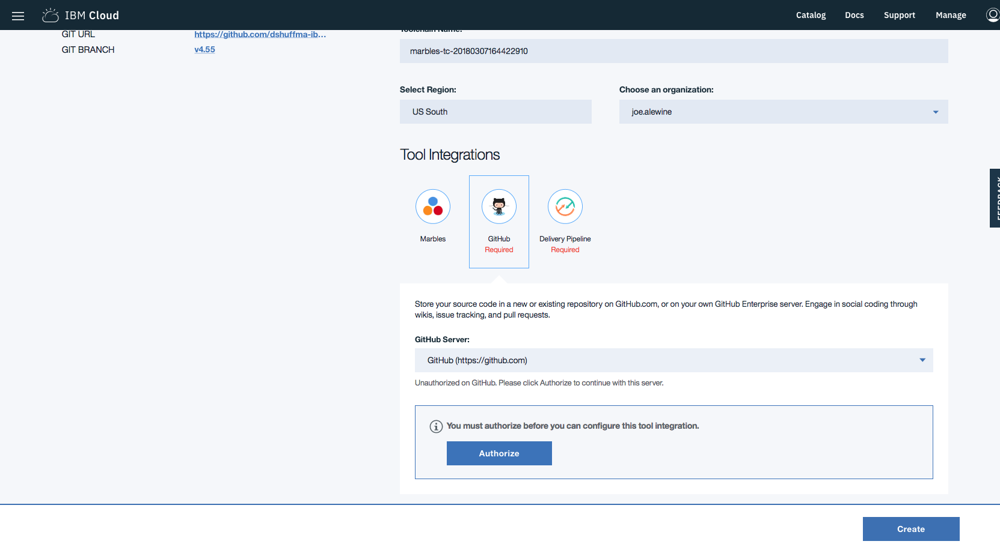
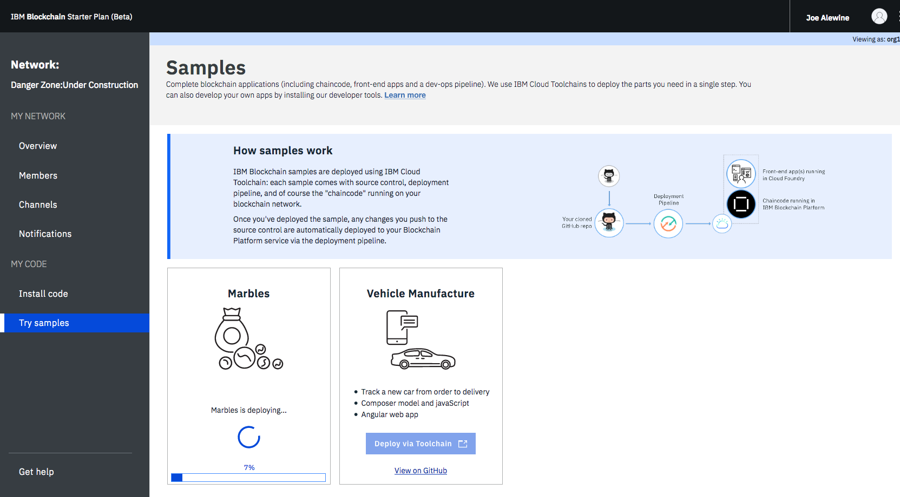

---

copyright:
  years: 2018
lastupdated: "2018-03-16"

---

{:new_window: target="_blank"}
{:shortdesc: .shortdesc}
{:screen: .screen}
{:codeblock: .codeblock}
{:pre: .pre}

# 샘플 애플리케이션 배치
{: #overview}

사용자가 블록체인 네트워크 및 애플리케이션 개발을 이해할 수 있도록 {{site.data.keyword.blockchainfull}} Platform은 사용자가 배치하고 테스트할 수 있는 샘플 애플리케이션을 제공합니다.
{: shortdesc}

스타터 플랜 네트워크를 프로비저닝하면 네트워크 모니터에 샘플 애플리케이션을 배치할 수 있으며, 샘플 애플리케이션이 네트워크에서 실행되도록 하는 단계가 자동화됩니다. 또한 단계별로 샘플을 사용하여 애플리케이션 배치의 전체 프로세스를 학습할 수 있으며, 고유 애플리케이션을 배치할 때 이 프로세스를 따라야 합니다.

## 스타터 플랜에 샘플 애플리케이션 배치

스타터 플랜은 몇 번의 클릭만으로 {{site.data.keyword.cloud_notm}}의 도구 체인 서비스를 활용하여 샘플 애플리케이션을 배치하는 간단한 방법을 제공합니다. 샘플 애플리케이션을 배치하고 실행하면 블록체인 네트워크에서 자동으로 이 애플리케이션이 실행됩니다.

스타터 플랜은 사용자에게 시작할 두 개의 샘플 애플리케이션을 제공합니다.

* **Marbles**

  Marbles 샘플을 사용하면 사용자는 서로 다른 특성으로 가상 Marbles를 작성하고 다른 사용자에게 전송할 수 있습니다. Marbles에 대한 자세한 정보는 [Marbles 데모 ](https://github.com/IBM-Blockchain/marbles)를 참조하십시오.

* **차량 제조업체**

  차량 제조업체 샘플을 사용하면 사용자는 가상 차량의 라이프사이클을 살펴볼 수 있습니다. 이 샘플에 대한 자세한 정보는 [차량 제조업체 ](https://github.com/IBM-Blockchain/vehicle-manufacture)를 참조하십시오. 

다음 단계를 완료하여 샘플 애플리케이션을 배치하십시오.

1. 스타터 플랜 네트워크의 **네트워크 모니터**를 시작하십시오. 없는 경우 [네트워크 작성](../get_start_starter_plan.html#creating-a-network)을 참조하십시오.

2. 네트워크 모니터에서 "샘플 시험 사용" 화면을 여십시오. 배치할 샘플 애플리케이션을 선택하고 **도구 체인을 통해 배치** 단추를 클릭하십시오.
<!--
    
-->
3. 도구 체인 서비스 구성 창이 열립니다. 모든 필수 도구가 올바르게 통합되었는지 확인하십시오. 둘 이상의 조직이 있는 경우 올바른 조직 이름을 입력했는지 확인하십시오. 조직 이름은 네트워크에 등록하는 데 사용하는 이메일 주소여야 합니다.
    **팁**: 도구 체인 서비스 구성 페이지가 열리도록 팝업 블로커를 사용 안함으로 설정해야 합니다.
<!--
    
-->
  도구 체인을 통해 배치하는 첫 번째 애플리케이션인 경우 GitHub 저장소에 액세스하는 권한을 도구 체인에 부여해야 합니다.

  

  "권한 부여" 단추를 클릭하면 GitHub로 이동합니다. GitHub 계정이 없으면 작성해야 합니다. 계정 정보를 입력하여 도구 체인에 저장소에 대한 액세스 권한을 제공하십시오. 도구 체인에 이 액세스 권한을 제공하지 않으려는 경우 샘플 애플리케이션을 수동으로 배치할 수 있습니다. 자세한 정보는 [샘플 애플리케이션 수동 배치](#deploy_sample_applications_manually)를 참조하십시오.

5. 도구 체인 페이지의 맨 아래에 있는 **작성** 단추를 클릭하십시오. 이렇게 하면 네트워크 모니터로 돌아가며, 여기서는 Marbles 배치가 진행 중이어야 합니다. 이 프로세스에는 5 - 10분이 걸립니다.
<!--
    
-->
배치가 완료되면 스타터 플랜 네트워크에서 Marbles 샘플을 사용할 수 있습니다.

이 프로세스를 통해 사용자가 액세스하고 제어할 수 있는 복제(fork)된 GitHub 저장소가 작성되므로 복제(fork)된 저장소에서 Marbles를 변경하고 이를 커미트할 수 있습니다. 이와 같이 커미트하면 Marbles 애플리케이션의 자동 빌드가 트리거되며 {{site.data.keyword.cloud_notm}}에서 이를 시연할 수 있습니다.

## 샘플 애플리케이션 수동 배치
{: #deploy_sample_applications_manually}

네트워크 모니터를 사용하지 않고 샘플 애플리케이션을 배치하려면 로컬 파일 시스템에 모든 필수 소프트웨어를 설치했는지 확인하십시오. 자세한 정보는 [애플리케이션 개발 환경 설정](../v10_application.html#setting-up-application-development-environment)을 참조하십시오.

또한 스타터 플랜 또는 엔터프라이즈 플랜을 사용할 때 {{site.data.keyword.cloud_notm}}에 블록체인 네트워크가 필요한 경우 채널 및 해당 피어를 구성하십시오. 자세한 정보는 [스타터 플랜 네트워크 통제](../get_start_starter_plan.html) 및 [엔터프라이즈 플랜 네트워크 통제](../get_start.html)를 참조하십시오. 네트워크를 프로비저닝하고 이 네트워크에 애플리케이션을 배치할 수 있으면 애플리케이션이 액세스할 네트워크 리소스의 API 엔드포인트를 검색하십시오. 자세한 정보는 [애플리케이션에 네트워크 API 엔드포인트 추가](../v10_application.html#adding-network-api-endpoints-to-your-application)를 참조하십시오.

네트워크에 다음 샘플 애플리케이션 중 하나를 배치할 수 있습니다.

- **Marbles**

  Marbles 애플리케이션에서는 여러 사용자가 서로 다른 특성으로 Marbles를 작성하고 다른 사용자에게 전송할 수 있습니다. Marbles 애플리케이션은 JavaScript로 작성되고 체인코드는 Go로 작성됩니다.

  [GitHub의 Marbles ](https://github.com/IBM-Blockchain/marbles)에서 샘플 코드 및 지시사항을 찾을 수 있습니다.

  Marbles 로컬 호스팅에 대한 지시사항이 아닌 Bluemix 지시사항을 사용하여 네트워크의 관련 정보를 입력하십시오. Marbles GitHub의 화면 캡처는 엔터프라이즈 플랜 UI를 표시하며(엔터프라이즈 플랜이 Marbles 배치를 위한 수동 경로만 지원하므로) 이는 스타터 플랜 UI와 약간 다릅니다. 두 UI에 동일한 기본 파트가 있더라도 해당 화면에서 피어와 채널의 이름 및 기타 서비스 신임 정보를 찾을 수 있습니다.

- **Fabcar**

  Fabcar에서 원장의 차량 레코드에 대한 **조회** 및 **원장 업데이트**를 수행할 수 있습니다. Fabcar는 JavaScript로 작성되고 체인코드는 Go로 작성됩니다.

  [GitHub의 Fabric car ](https://github.com/hyperledger/fabric-samples/tree/release/fabcar)에서 샘플 코드를 찾고, [Writing Your First Application ](http://hyperledger-fabric.readthedocs.io/en/latest/write_first_app.html)에서 지시사항을 찾을 수 있습니다.

- **기타 애플리케이션**

  {{site.data.keyword.cloud_notm}} 내에서 고유 애플리케이션을 호스팅하는 방법에 대한 자세한 정보는 [애플리케이션 호스팅](../v10_application.html#hosting-applications)을 참조하십시오.

## 샘플 애플리케이션 삭제

도구 체인 프로세스를 통해 확보한 샘플 애플리케이션을 삭제하려면 UI에서 샘플이 있는 위치를 탐색하십시오. 샘플 애플리케이션이 채널에서 인스턴스화되므로 채널에서 샘플을 찾을 수 있습니다. 왼쪽 탐색에서 **채널**을 클릭하여 "채널" 화면을 여십시오. 샘플이 인스턴스화된 관련 채널을 클릭한 다음 **체인코드**를 클릭하십시오. 이렇게 하면 이 채널에서 인스턴스화된 체인코드가 표시됩니다.

애플리케이션의 체인코드를 클릭하면 **삭제** 탭을 볼 수 있습니다. 하지만 **삭제**를 클릭하면 샘플 애플리케이션은 삭제되지 않고 체인코드 컨테이너만 삭제됩니다. 샘플을 삭제하려면 {{site.data.keyword.cloud_notm}} 대시보드 및 도구 체인 대시보드로 이동해야 합니다.
