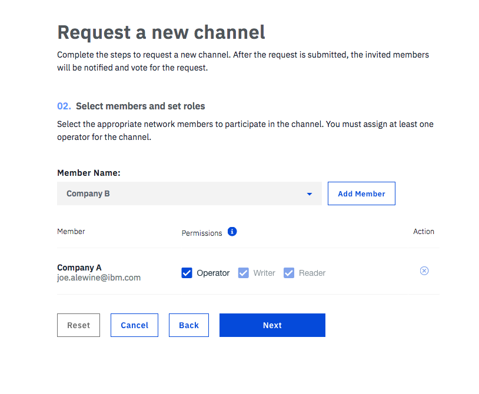
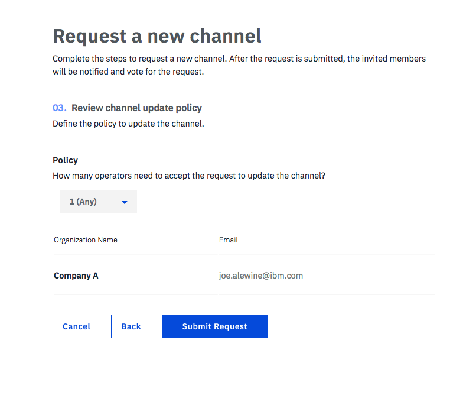

---

copyright:
  years: 2017, 2018
lastupdated: "2018-03-16"

---

{:new_window: target="_blank"}
{:shortdesc: .shortdesc}
{:screen: .screen}
{:codeblock: .codeblock}
{:pre: .pre}

# Criando ou atualizando um canal

Os canais são um mecanismo muito poderoso para particionamento e isolamento de dados e eles fornecem a base principal
para privacidade de dados. Apenas membros do mesmo canal podem acessar os dados desse canal.
{:shortdesc}

Para garantir a segurança do canal, a política de atualização do canal é configurada para definir o número de operadores de canal que precisam concordar com a solicitação de criação ou atualização do canal antes de um canal ser criado ou atualizado.

## Criando um canal
Clique no botão **Novo canal** na tela "Canais" de seu Monitor de Rede e conclua as etapas a seguir para enviar uma solicitação de criação de canal:
1. Escolha um nome refletivo do objetivo de negócios do canal, inclua uma descrição, se desejar, e clique em **Avançar**. O nome do canal deve ser exclusivo em uma rede de Blockchain. Ele deve iniciar com uma letra e pode conter apenas caracteres minúsculos, números ou traços.
  

2. Convide qualquer combinação de seus membros de rede selecionando membros de rede e clicando no botão **Incluir membro**. Customize as permissões designando funções para cada um dos membros convidados e clique em **Avançar**.
  

    * Um operador de canal pode consultar ou atualizar o livro-razão do canal. O operador de canal tem autoridade para **Aceitar** ou **Recusar** uma solicitação de criação do canal e para enviar uma solicitação de atualização do canal. Deve haver pelo menos um **Operador** em cada canal.
    * Um escritor de canal pode atualizar o livro-razão do canal.
    * Um leitor de canal pode apenas consultar o livro-razão do canal.

3. Configure a política de atualização do canal selecionando o número de operadores de canal para aprovar a solicitação de atualização do canal e clique em **Enviar solicitação**.
  

Os membros convidados receberão um e-mail de convite. Eles também podem localizar a solicitação nas subguias "Todos" ou "Pendente" na tela **Notificações** do Monitor de Rede.
* Membros que são convidados como operadores de canal podem clicar no botão **Revisar solicitação** para revisar a configuração do canal e, em seguida, nos botões **Aceitar** ou **Recusar** a solicitação. A coluna "Meu status" mostra o status de voto do operador na solicitação:
    * _Votação pendente_: o operador não manipulou a solicitação.
    * _Voto aceito_: o operador aceitou a solicitação.
    * _Voto recusado_: o operador recusou a solicitação.
    * _Voto de fechamento_: a solicitação recebe votos **Aceitar** suficientes e o operador não precisa de tempo aceitar ou recusar.
* Os membros que são convidados como escritores ou leitores de canal podem ver *Não é necessário* na coluna "Meu status". Antes de a solicitação receber votos **Aceitar** suficientes de operadores de canal, os escritores ou leitores podem clicar no botão **Revisar solicitação** para verificar a configuração do canal.

Quando operadores de canal suficientes concordarem com a solicitação, qualquer membro do canal poderá clicar no botão **Enviar solicitação** e o novo canal será criado. Todos os membros do canal podem localizar o canal na tela "Canais" de seu Monitor de Rede.

### Criando canais gerenciados

Em mercados de câmbio estrangeiros altamente regulados, para usar um exemplo, pode ser necessário colocar um terceiro confiável encarregado das funções administrativas em canais que normalmente seriam controlados por vários operadores ou membros.

Nesse caso, o terceiro confiável se tornaria o único "Operador" para um canal e designaria outros membros como "Gravadores". Isso daria ao terceiro a autoridade exclusiva para editar o canal enquanto ainda fornece aos dois bancos a capacidade de chamar transações. Um canal gerenciado "somente leitura" também poderia ser criado configurando outros membros como "Leitores".

## Atualizando um canal
Se você desejar modificar a configuração de um canal, por exemplo, incluir ou remover membros do canal ou mudar a política de atualização do canal, será possível enviar uma solicitação de atualização do canal. Na tela "Canais" de seu Monitor de rede, localize o canal que você deseja modificar e selecione **Editar canal** na lista suspensa sob o cabeçalho **Ação**. Navegue pelos painéis para fazer mudanças nas entidades desejadas e clique em **Enviar solicitação** para iniciar uma solicitação de atualização do canal.

Todos os membros do canal receberão notificações por e-mail na solicitação de atualização do canal:
* Os membros convidados recentemente receberão notificações por e-mail convidando-os a participar do canal. Eles também podem localizar a solicitação com o status "Votação pendente" na tela **Notificações** do Monitor de rede.
    * Membros que são convidados como operadores de canal podem clicar no botão **Revisar solicitação** para revisar a configuração do canal e, em seguida, **Aceitar** ou **Recusar** a solicitação de atualização do canal.  A coluna "Meu status" mostra o status de voto do operador na solicitação:
        * _Votação pendente_: o operador não manipulou a solicitação.
        * _Voto aceito_: o operador aceitou a solicitação.
        * _Voto recusado_: o operador recusou a solicitação.
        * _Voto de fechamento_: a solicitação recebe votos **Aceitar** suficientes e o operador não precisa de tempo aceitar ou recusar.
    * Os membros que são convidados como escritores ou leitores de canal podem ver *Não é necessário* na coluna "Meu status". Antes de a solicitação receber votos **Aceitar** suficientes de operadores de canal, os escritores ou leitores podem clicar no botão **Revisar solicitação** para verificar a configuração do canal.
* Os membros removidos recebem notificações por e-mail sobre a mudança do canal.
* Os operadores existentes do canal receberão notificações por e-mail sobre a atualização do canal. Eles poderão localizar a solicitação com o status _Votação pendente_ na tela **Notificações** do Monitor de rede para **Aceitar** ou **Recusar**.
* Escritores ou leitores existentes do canal também receberão notificações por e-mail sobre a atualização do canal. Eles poderão localizar a solicitação com o status _Não necessário_ na tela **Notificações** do Monitor de rede.

Quando operadores de canal suficientes concordarem com a solicitação, qualquer membro do canal poderá clicar no botão **Enviar solicitação** e o canal será atualizado. Todos os membros do canal poderão localizar o canal atualizado na tela "Canais" do Monitor de rede.
