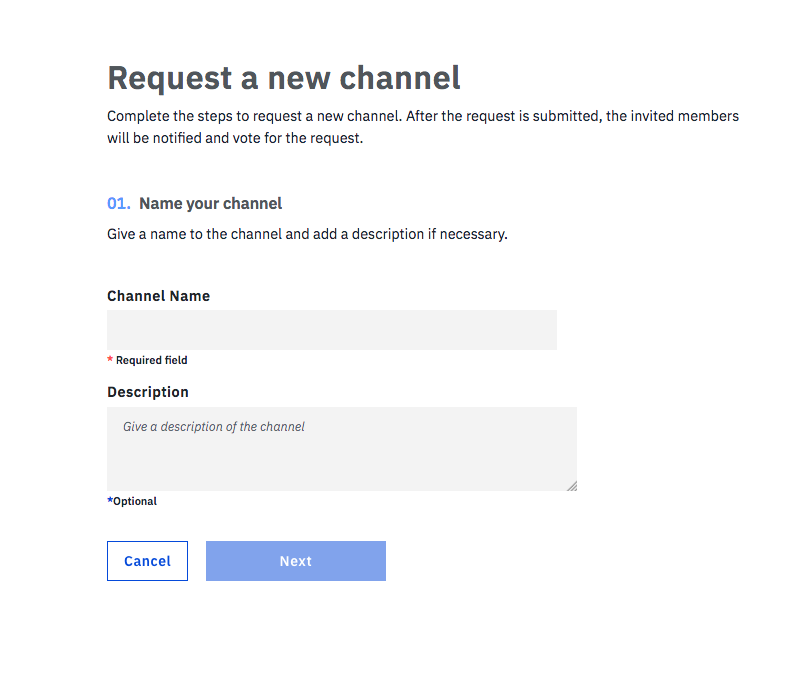

---

copyright:
  years: 2017, 2018
lastupdated: "2018-03-16"

---

{:new_window: target="_blank"}
{:shortdesc: .shortdesc}
{:screen: .screen}
{:codeblock: .codeblock}
{:pre: .pre}

# 建立或更新通道

通道是可分割及隔離資料的功能特別強大的機制，並且提供資料隱私權的主要基礎。只有相同通道的成員才能存取此通道的資料。
{:shortdesc}

為了確保通道安全，已配置通道更新原則，來定義在建立或更新通道之前，需要同意通道建立或更新要求的通道操作員數目。

## 建立通道
在「網路監視器」的「通道」畫面中，按一下**新建通道**按鈕，並完成下列步驟，以提交通道建立要求：
1. 選擇可反映通道商業目標的名稱，並視需要新增說明，然後按**下一步**。通道名稱在區塊鏈網路中必須是唯一的。它必須以字母開頭，並且只能包含小寫字元、數字或橫線。

2. 選取網路成員，然後按一下**新增成員**按鈕，以邀請任何組合的網路成員。為每個受邀的成員指派角色，以自訂許可權，然後按**下一步**。

    * 通道操作員可以查詢或更新通道分類帳。通道操作員有權**接受**或**拒絕**建立通道要求，以及提交更新通道要求。每個通道中必須至少有一個**操作員**。
    * 通道撰寫者可以更新通道分類帳。
    * 通道讀取者只能查詢通道分類帳。

3. 選取需要核准通道更新要求的通道操作員數目，以配置通道更新原則，然後按一下**提交要求**。
  

受邀的成員將會收到邀請電子郵件。他們也可以在「網路監視器」之**通知**畫面的「全部」或「擱置中」子標籤中找到要求。
* 受邀成為通道操作員的成員可以按一下**檢閱要求**按鈕來檢閱通道配置，然後**接受**或**拒絕**要求。「我的狀態」直欄會顯示操作員對要求的投票狀態：
    * _投票擱置中_：操作員未處理要求。
    * _已接受投票_：操作員已接受要求。
    * _已拒絕投票_：操作員已拒絕要求。
    * _投票關閉_：要求獲得足夠的**接受**投票，而且操作員不再需要接受或拒絕。
* 受邀成為通道撰寫者或讀取者的成員會在「我的狀態」直欄下看到*不需要*。要求獲得通道操作員足夠的**接受**投票之前，撰寫者或讀取者可以按一下**檢閱要求**按鈕，以檢查通道配置。

當有足夠的通道操作員同意要求時，任何通道成員都可以按一下**提交要求**按鈕，並建立新的通道。所有通道成員都可以在其「網路監視器」的「通道」畫面中找到該通道。

### 建立受管理通道

舉例來說，在高度控管的外匯市場中，可能需要由具公信力的第三者來負責管理通常是由各種不同操作員或成員所操控的通道。

在此情況下，具公信力的第三者會使自己成為通道的唯一「操作員」，並指派其他成員為「撰寫者」。如此將會賦予該第三者獨有的權限來編輯通道，同時仍讓這兩家銀行能夠呼叫交易。另外，也可以藉由將其他成員設為「讀取者」的方式，來建立受管理的「唯讀」通道。

## 更新通道
如果您想要修改通道的配置，例如，新增或移除通道成員，或是變更通道更新原則，則可以提交通道更新要求。在「網路監視器」的「通道」畫面中，找出您要修改的通道，然後從**動作**標頭下的下拉清單中選取**編輯通道**。請導覽畫面以變更所需的實體，然後按一下**提交要求**以起始通道更新要求。

所有通道成員都會收到有關通道更新要求的電子郵件通知：
* 新受邀的成員會收到邀請他們加入通道的電子郵件通知。他們也可以在「網路監視器」的**通知**畫面中，找到狀態為「投票擱置中」的要求。
    * 受邀成為通道操作員的成員可以按一下**檢閱要求**按鈕，以檢閱通道配置，然後**接受**或**拒絕**通道更新要求。「我的狀態」直欄會顯示操作員對要求的投票狀態：
        * _投票擱置中_：操作員未處理要求。
        * _已接受投票_：操作員已接受要求。
        * _已拒絕投票_：操作員已拒絕要求。
        * _投票關閉_：要求獲得足夠的**接受**投票，而且操作員不再需要接受或拒絕。
    * 受邀成為通道撰寫者或讀取者的成員會在「我的狀態」直欄下看到*不需要*。要求獲得通道操作員足夠的**接受**投票之前，撰寫者或讀取者可以按一下**檢閱要求**按鈕，以檢查通道配置。
* 已移除的成員會收到有關通道變更的電子郵件通知。
* 現有的通道操作員會收到有關通道更新的電子郵件通知。他們也可以在「網路監視器」的**通知**畫面中，找到狀態為_投票擱置中_ 的要求，以供他們**接受**或**拒絕**。
* 現有的通道撰寫者或讀取者也會收到有關通道更新的電子郵件通知。他們可以在「網路監視器」的**通知**畫面中，找到狀態為_不需要_ 的要求。

當有足夠的通道操作員同意要求時，任何通道成員都可以按一下**提交要求**按鈕，並更新通道。所有通道成員都可以在「網路監視器」的「通道」畫面中找到更新的通道。
