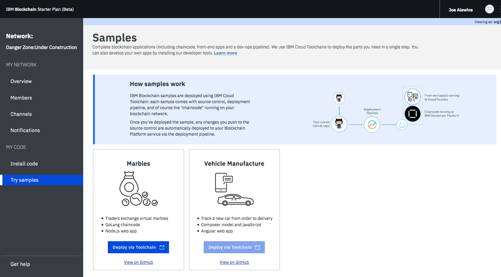
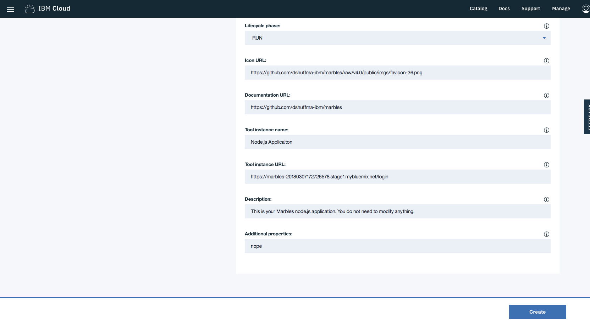

---

copyright:
  years: 2018
lastupdated: "2018-03-16"

---

{:new_window: target="_blank"}
{:shortdesc: .shortdesc}
{:screen: .screen}
{:codeblock: .codeblock}
{:pre: .pre}

# 部署範例應用程式
{: #overview}

「{{site.data.keyword.blockchainfull}} 平台」提供可部署及測試的範例應用程式，讓您能夠進一步瞭解區塊鏈網路和應用程式開發。
{: shortdesc}

佈建「入門範本方案」網路之後，您可以在「網路監視器」中部署範例應用程式，這會將步驟自動化，讓範例應用程式能夠在您的網路上執行。您也可以逐步啟用範例，以學習應用程式部署的整個處理程序，當您部署自己的應用程式時，需要遵循這個處理程序。

## 在入門範本方案中部署範例應用程式

「入門範本方案」提供簡單的方式來部署範例應用程式，其運用 {{site.data.keyword.cloud_notm}} 上的「工具鏈」服務，只要按幾下即可完成。範例應用程式在完成部署並啟動之後，會自動在您的區塊鏈網路上執行。

「入門範本方案」提供兩個範例應用程式來協助您入門。

* **Marbles**

  Marbles 範例可讓使用者建立具有不同內容的虛擬彈珠，並與其他使用者互相轉移彈珠。如需 Marbles 的相關資訊，請參閱 [Marbles 示範 ](https://github.com/IBM-Blockchain/marbles)。

* **Vehicle Manufacture**

  Vehicle Manufacture 範例可讓使用者體驗虛擬汽車的整個生命週期。如需此範例的相關資訊，請參閱 [Vehicle Manufacture ](https://github.com/IBM-Blockchain/vehicle-manufacture)。 

請完成下列步驟來部署範例應用程式：

1. 進入「入門範本方案」網路的**網路監視器**。如果您沒有該網路，請參閱[建立網路](../get_start_starter_plan.html#creating-a-network)。

2. 在「網路監視器」中開啟「嘗試範例」畫面。選擇您要部署的範例應用程式，然後按一下**透過工具鏈進行部署**按鈕。
<!--
    
-->
3. 「工具鏈」服務配置視窗隨即開啟。確定所有必要工具都已正確整合。請注意，如果您有多個組織，請確定輸入的組織名稱正確。組織名稱應該是您用來註冊網路的電子郵件位址。
    **提示**：您必須停用蹦現封鎖程式，「工具鏈」服務配置頁面才能開啟。
<!--
    
-->
如果這是您透過「工具鏈」部署的第一個應用程式，您必須授權「工具鏈」存取 GitHub 儲存庫。

  

  按一下「授權」按鈕之後，您就會進入 GitHub。如果您沒有 GitHub 帳戶，則需要建立該帳戶。輸入帳戶資訊，讓「工具鏈」能夠存取您的儲存庫。如果您不想提供此存取權給「工具鏈」，可以手動部署範例應用程式。如需相關資訊，請參閱[手動部署範例應用程式](#deploy_sample_applications_manually)。

5. 按一下「工具鏈」頁面底端的**建立**按鈕。這樣應該會讓您回到「網路監視器」，其中應該正在進行 Marbles 部署。此處理程序應該需要 5 到 10 分鐘。
<!--
    
-->
部署完成之後，您就可以開始在「入門範本方案」網路中使用 Marbles 範例。

由於此處理程序會建立分出的 GitHub 儲存庫，而您擁有其存取權和控制權，因此您可以在分出的儲存庫中對 Marbles 進行變更，並加以確定。這些確定動作會觸發 Marbles 應用程式的自動建置處理程序，並可讓您在 {{site.data.keyword.cloud_notm}} 中示範操作。

## 入門範本方案」或「手動部署範例應用程式
{: #deploy_sample_applications_manually}

如果您要部署範例應用程式，但不想使用「網路監視器」，請確定您已在本端檔案系統上安裝所有軟體必備項目。如需相關資訊，請參閱[設定應用程式開發環境](../v10_application.html#setting-up-application-development-environment)。

您在 {{site.data.keyword.cloud_notm}} 上也需要有使用「入門範本方案」或「企業方案」的區塊鏈網路，並配置通道及其對等節點。如需相關資訊，請參閱[控管入門範本方案網路](../get_start_starter_plan.html)和[控管企業方案網路](../get_start.html)。在您佈建網路並可以在其上部署應用程式之後，請擷取應用程式將要存取之網路資源的 API 端點。如需相關資訊，請參閱[將網路 API 端點新增至應用程式](../v10_application.html#adding-network-api-endpoints-to-your-application)。

您可以將下列其中一個範例應用程式部署至您的網路：

- **Marbles**

  在 Marbles 應用程式中，多個使用者可以建立具有不同內容的彈珠，並將彈珠轉移給其他使用者。Marbles 應用程式是以 JavaScript 撰寫，而鏈碼是以 Go 撰寫。

  您可以在 [GitHub 中的 Marbles ](https://github.com/IBM-Blockchain/marbles) 中找到範例程式碼和指示。

  請使用 Bluemix 指示，而不是使用在本端管理 Marbles 的指示，並輸入來自網路的相關資訊。請注意，Marbles GitHub 中的畫面擷取是顯示「企業方案」使用者介面（因為「企業方案」僅支援手動部署 Marbles 的途徑），與「入門範本方案」使用者介面稍微不同。不過，這兩種使用者介面都有相同的基本部分，您可以在適當的畫面中找到對等節點的名稱、通道及其他服務認證資訊。

- **Fabcar**

  在 Fabcar 中，您可以對分類帳中的汽車記錄執行**查詢**和**分類帳更新**。Fabcar 是以 JavaScript 撰寫，而鏈碼是以 Go 撰寫。

  您可以在 [GitHub 中的 Fabric Car ](https://github.com/hyperledger/fabric-samples/tree/release/fabcar) 中找到範例程式碼，並可在[撰寫您的第一個應用程式 ](http://hyperledger-fabric.readthedocs.io/en/latest/write_first_app.html) 中找到指示。

- **其他應用程式**

  若要瞭解如何在 {{site.data.keyword.cloud_notm}} 中管理您自己的應用程式，請參閱[管理應用程式](../v10_application.html#hosting-applications)。

## 刪除範例應用程式

若要刪除透過「工具鏈」處理程序取得的範例應用程式，請導覽至該範例在使用者介面中的位置。由於範例應用程式已在通道上實例化，因此您可以在通道中找到該範例。按一下左導覽中的**通道**，以開啟「通道」畫面。按一下範例實例化所在的相關通道，然後按一下**鏈碼**。這樣會顯示在此通道上實例化的鏈碼。

如果您按一下應用程式的鏈碼，就可以看到**刪除**標籤。然而，只是按一下**刪除**並不會刪除範例應用程式，這只會刪除鏈碼容器。您還需要導覽至 {{site.data.keyword.cloud_notm}} 儀表板和「工具鏈」儀表板，在那裡才能刪除範例。
